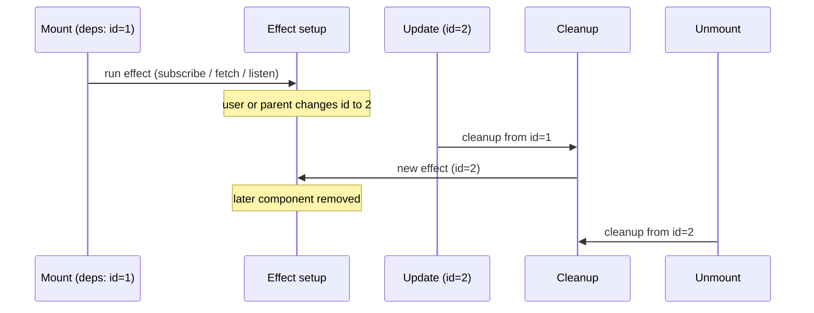

# useEffect — notes, APIs in the browser, and cleanup

**`useEffect`** lets a component **run side effects after render** — work that reaches **outside** React’s render output: the network, timers, the DOM, subscriptions, and other browser APIs. It is **not** for computing what JSX should be; that stays in the component body or derived values.

For how effects sit **after paint** in the browser pipeline, see [React rendering flow](/course-notes/react-rendering-flow).

---

## What `useEffect` is

| Idea | Detail |
|------|--------|
| **When it runs** | After React has **committed** DOM updates for that render, and — for the **default** (“passive”) effect — **after the browser has painted** the result. So it does not block the user from seeing pixels first. |
| **What you put in it** | **Side effects**: `fetch`, `addEventListener`, `setInterval`, opening a WebSocket, subscribing to a store, mutating non-React state, etc. |
| **What you avoid** | **Deriving UI from props/state** (do that during render). **Synchronous layout** that must run before paint (reach for `useLayoutEffect` when you truly need it). |

```jsx
import { useEffect, useState } from 'react';

function Example() {
  const [n, setN] = useState(0);

  useEffect(() => {
    document.title = `Count is ${n}`;
  }, [n]);

  return <button onClick={() => setN((x) => x + 1)}>{n}</button>;
}
```

The **second argument** is the **dependency array**:

- **`[n]`** — run the effect **after** render when `n` changed (and once on mount).
- **`[]`** — run **once** after mount (and cleanup on unmount).
- **Omitted** (`useEffect(() => { … })`) — run **after every** render. Easy to misuse; prefer an explicit dependency list whenever you know what should trigger the effect.

---

## When does the cleanup function run?

If your effect callback **returns a function**, React treats it as a **cleanup** function.

Cleanup runs in exactly two situations:

| Situation | What happens |
|-----------|----------------|
| **A. The effect is about to run again** | Dependencies **changed** (or you used a missing dependency list and every render re-schedules the effect). React **first** runs the **previous** cleanup, **then** runs the new effect body. |
| **B. The component unmounts** | React runs cleanup for the **last** committed version of the effect so you can release resources. |

So: **cleanup = “tear down what the last run of this effect set up,”** either because inputs changed or because the component is leaving the tree.



**Order on reordering:** When dependency changes: **cleanup → new effect**. On unmount: **cleanup only**.

**Strict Mode (development):** React may **mount → unmount → remount** once to help you find missing cleanups. If cleanup is correct, the effect still works; if not, you’ll see duplicated listeners or requests until you fix it.

---

## Example: `fetch` and `AbortController` (cleanup cancels the request)

If the user navigates away or a dependency (e.g. `userId`) changes **before** `fetch` finishes, you should **abort** the request so an old response cannot call `setState` on an unmounted component or with stale data.

```jsx
import { useEffect, useState } from 'react';

function UserProfile({ userId }) {
  const [data, setData] = useState(null);
  const [error, setError] = useState(null);

  useEffect(() => {
    setData(null);
    setError(null);

    const controller = new AbortController();

    fetch(`https://jsonplaceholder.typicode.com/users/${userId}`, {
      signal: controller.signal,
    })
      .then((res) => {
        if (!res.ok) throw new Error(res.statusText);
        return res.json();
      })
      .then(setData)
      .catch((err) => {
        if (err.name === 'AbortError') return;
        setError(err);
      });

    return () => controller.abort();
  }, [userId]);

  if (error) return <p role="alert">{String(error)}</p>;
  if (!data) return <p>Loading…</p>;

  return <p>{data.name}</p>;
}
```

**What cleanup does here:** When `userId` changes or the component unmounts, `abort()` runs. The in-flight `fetch` rejects with `AbortError`; you ignore that in `catch` so it does not look like a real failure.

---

## Example: `window` event listener

Listeners must be **removed** when the effect is torn down; otherwise you leak listeners (and stale closures) across hot paths.

```jsx
import { useEffect, useState } from 'react';

function WindowWidth() {
  const [w, setW] = useState(() => window.innerWidth);

  useEffect(() => {
    const handler = () => setW(window.innerWidth);
    window.addEventListener('resize', handler);
    return () => window.removeEventListener('resize', handler);
  }, []);

  return <span>{w}px</span>;
}
```

**Why store `handler` in a variable:** `removeEventListener` must receive the **same function reference** you passed to `addEventListener`.

---

## Example: DOM / custom element listener

Same pattern with a ref if you attach to a specific node:

```jsx
import { useEffect, useRef } from 'react';

function ClickOutside({ children, onOutside }) {
  const ref = useRef(null);

  useEffect(() => {
    const el = ref.current;
    if (!el) return;

    function handlePointerDown(event) {
      if (!el.contains(event.target)) onOutside();
    }

    document.addEventListener('pointerdown', handlePointerDown);
    return () => document.removeEventListener('pointerdown', handlePointerDown);
  }, [onOutside]);

  return <div ref={ref}>{children}</div>;
}
```

If `onOutside` is recreated every render, this effect re-runs often; parents often wrap that callback in **`useCallback`** so the dependency stays stable when appropriate.

---

## Example: `setInterval` / `setTimeout`

Timers must be **cleared** on cleanup so they do not fire after unmount or after logic should stop.

```jsx
import { useEffect, useState } from 'react';

function Clock() {
  const [now, setNow] = useState(() => new Date());

  useEffect(() => {
    const id = window.setInterval(() => setNow(new Date()), 1000);
    return () => window.clearInterval(id);
  }, []);

  return <time>{now.toLocaleTimeString()}</time>;
}
```

---

## Other cleanup patterns (same rule)

| Pattern | Setup | Cleanup |
|---------|--------|---------|
| **Third-party subscription** | `const sub = client.subscribe(fn)` | `sub.unsubscribe()` |
| **WebSocket** | `new WebSocket(url)` | `socket.close()` |
| **`matchMedia`** | `mql.addEventListener('change', fn)` | `mql.removeEventListener('change', fn)` |
| **BroadcastChannel / channel port** | `new BroadcastChannel('x')` | `channel.close()` |

The **rule** is always: **whatever you start in the effect, stop or undo it in cleanup** when the effect’s “session” for those dependencies ends.

---

## Mental checklist

| Question | Answer |
|----------|--------|
| Does cleanup run on **every** render? | **No.** It runs **before** the next effect run (if deps changed) and on **unmount**. |
| If deps are `[]`, when does cleanup run? | **Only on unmount** (and in Strict Mode’s dev remount cycle). |
| Why abort `fetch` in cleanup? | So a **late response** does not update state after unmount or with an **outdated** `userId`. |
| Is empty deps `[]` “run once”? | **Runs once per mount** in production; dev Strict Mode may run effects **twice** to surface bugs — design cleanup so that is safe. |

---

## Appendix: the `ignore` flag, stale responses, and cleanup timing

This pattern is an alternative to [`AbortController`](#example-fetch-and-abortcontroller-cleanup-cancels-the-request) for async work: a **boolean in the effect’s closure** is flipped in cleanup so an **old** in-flight request can bail out before calling `setState`.

```jsx
React.useEffect(() => {
  let ignore = false;

  const handleFetchPokemon = async () => {
    setLoading(true);
    setError(null);

    const { error, response } = await fetchPokemon(id);

    if (ignore) {
      return;
    } else if (error) {
      setError(error.message);
    } else {
      setPokemon(response);
    }

    setLoading(false);
  };

  handleFetchPokemon();

  return () => {
    ignore = true;
  };
}, [id]);
```

### How can `id` change while the first request is still in flight?

`id` is whatever you put in the dependency array—often a **prop** or **route param**. It changes when **React re-renders this component** with a new `id` **before** `await fetchPokemon(id)` resolves. Typical cases:

- User picks a different item in a list or dropdown (parent updates state → new `id` prop).
- URL changes (`/pokemon/1` → `/pokemon/2`) and the router passes a new param.
- A search box debounces and the parent passes a new id.

The first `handleFetchPokemon` is **still suspended** on the `await`. Network latency is exactly what creates the race: response A can finish **after** the user has already moved on to id B.

### Why `ignore = true` does **not** break “all future requests”

Each time the effect callback **runs**, JavaScript creates a **new** `let ignore = false` binding scoped to **that** run. The cleanup function returned from that run **closes over that same binding**.

When `id` changes:

1. React runs the **previous** cleanup → it sets **that run’s** `ignore` to `true`.
2. React runs a **new** effect → a **fresh** `ignore` starts as `false` again.

So you have **one `ignore` per effect run**, not one global flag. Old async code still holds a reference to the **old** binding; new code holds the **new** binding.

### Happy path: one `id`, request finishes while still current

| Step | What runs | `ignore` for this effect run |
|------|-----------|------------------------------|
| 1 | Effect runs for `id = 1` | `false` |
| 2 | `handleFetchPokemon()` starts, awaits network | `false` |
| 3 | Response returns | `false` |
| 4 | `if (ignore)` is false → apply result, `setLoading(false)` | `false` |
| 5 | (No cleanup until unmount or `id` changes) | — |

No cleanup ran between start and finish, so the result is applied.

### Race path: `id` changes before the first response returns

Assume request for `id=1` is slow; user switches to `id=2` quickly.

| Step | What runs | Effect run / binding |
|------|-----------|------------------------|
| 1 | Effect **run A** for `id=1` | Run A’s `ignore` is `false` |
| 2 | `handleFetchPokemon` (for 1) awaits | still run A |
| 3 | `id` becomes `2` → React runs **cleanup for A** | Run A’s `ignore` becomes `true` |
| 4 | Effect **run B** for `id=2` | Run B has a **new** `ignore`, still `false` |
| 5 | `handleFetchPokemon` (for 2) starts, awaits | run B |
| 6 | Response for **1** arrives (late) | That async closure still reads **run A’s** `ignore` |
| 7 | `if (ignore)` → **true** → `return` | Stale update skipped ✓ |
| 8 | Response for **2** arrives | Sees **run B’s** `ignore` still `false` → updates UI ✓ |

```mermaid
sequenceDiagram
  participant React
  participant EffectA as Effect run A (id=1)
  participant Net as Network
  participant CleanupA as Cleanup A
  participant EffectB as Effect run B (id=2)

  React->>EffectA: run; ignore_A = false
  EffectA->>Net: fetchPokemon(1) in flight
  Note over React: id prop becomes 2
  React->>CleanupA: run cleanup for A
  CleanupA->>EffectA: ignore_A = true
  React->>EffectB: run; ignore_B = false
  EffectB->>Net: fetchPokemon(2) in flight
  Net-->>EffectA: response for 1 (late)
  Note over EffectA: await resumes; reads ignore_A → true → return (no setPokemon for 1)
  Net-->>EffectB: response for 2
  Note over EffectB: ignore_B false → setPokemon(2) ✓
```

### Failure path: unmount while fetching

Same idea as row 3–7 above, but instead of run B, the component **unmounts**. Cleanup sets `ignore` for the last run to `true`; when the fetch settles, the async function returns early and should not update state on an unmounted tree (still avoid other side effects if any).

### Small gotcha in the snippet above

If `ignore` is `true`, the code **returns before** `setLoading(false)`, so **loading can stay stuck `true`** for that abandoned request. In production code, use a `try` / `finally`, or set loading false in a branch that runs even when ignored, or prefer **`AbortController`** so the promise rejects and you handle it in one place.

---

## Where to go next

- **Render vs commit vs effects**: [React rendering flow](/course-notes/react-rendering-flow).
- **Data flow patterns** (handlers, lifting state): [React data flow patterns](/course-notes/react-data-flow-patterns).

Official docs: **Synchronizing with Effects** and **Lifecycle of Reactive Effects** in the React documentation — the authoritative source for edge cases and updates between React versions.
